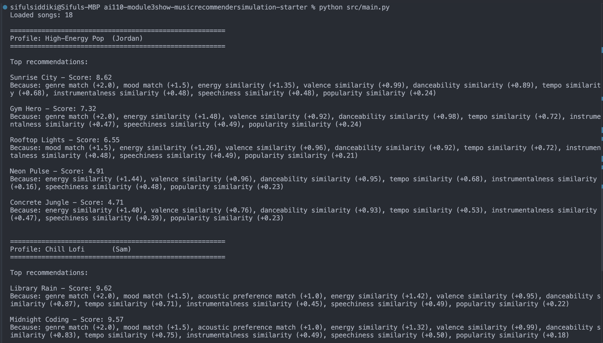
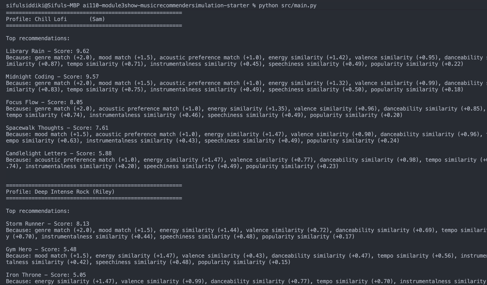
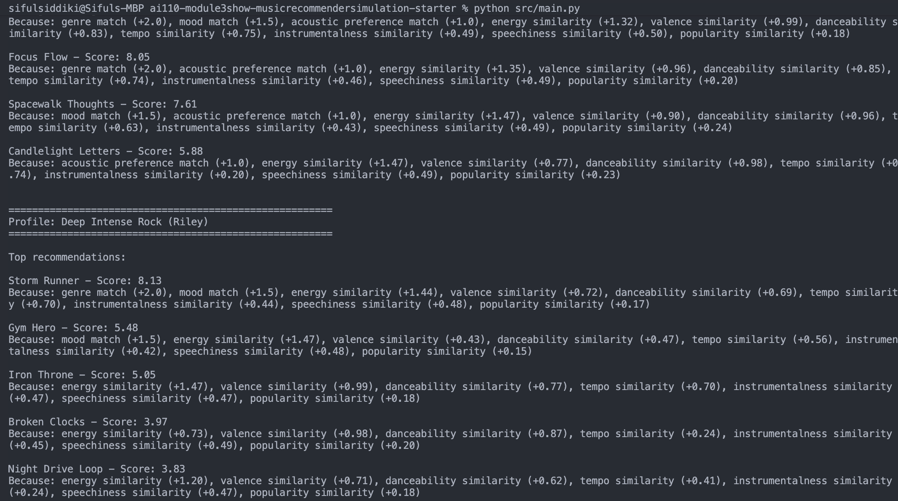
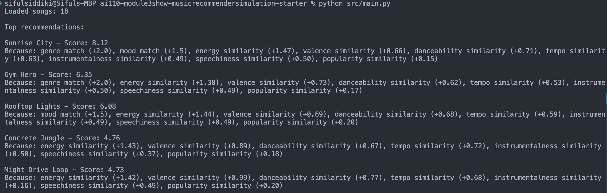

# 🎵 Music Recommender Simulation

The first thing that happens in a scoring system is that there are a set of rules created in order to reduce the number of songs from a large amount into a manageable amount. Then the songs are individually run through a scoring rule, where they are rated based on rules that the system has established. Then the songs are put through a ranking rule in order to create an order for the songs based on the rules that were provided. Finally, we have a way to filter through the system and remove songs that may be repeating, region-locked, or blocked by the user. 

## Project Summary

In this project you will build and explain a small music recommender system.

Your goal is to:

- Represent songs and a user "taste profile" as data
- Design a scoring rule that turns that data into recommendations
- Evaluate what your system gets right and wrong
- Reflect on how this mirrors real world AI recommenders

Replace this paragraph with your own summary of what your version does.

---

This project is a music recommender simulation that scores and ranks songs from a CSV catalog against a user's stated listening preferences across multiple audio dimensions — genre, mood, energy, tempo, valence, danceability, and more. Each song receives a numerical score based on a weighted formula that rewards both exact string matches (genre and mood) and continuous similarity (how close a song's audio features are to the user's targets), then returns the top-k results with a plain-language explanation of why each song was chosen. The system supports multiple user profiles simultaneously, making it easy to compare how different listener types — from high-energy pop fans to chill lofi students to intense rock listeners — receive entirely different ranked recommendations from the same song catalog.

## How The System Works

Each `Song` in this system is represented by thirteen attributes: a unique ID, title, artist, and ten numerical or categorical features — genre, mood, energy, tempo (BPM), valence (emotional positivity), danceability, acousticness, instrumentalness, speechiness, and popularity. The `UserProfile` mirrors those features as preferences: a favorite genre, a favorite mood, a boolean for whether the user likes acoustic music, and numerical targets for energy, valence, danceability, tempo, instrumentalness, speechiness, and popularity. To compute a score for each song, the `Recommender` runs every song in the catalog through a fixed recipe: it awards +2.0 points for a genre match, +1.5 points for a mood match, and +1.0 points when the user likes acoustic music and the song's acousticness is at or above 0.6. For the remaining features, it adds similarity points using the formula `(1 - abs(song.value - user.target)) * weight`, with weights of 1.5 for energy, 1.0 each for valence and danceability, 0.75 for tempo, 0.5 each for instrumentalness and speechiness, and 0.25 for popularity — giving a maximum possible score of 10.0. Once every song has been scored, the system sorts the full list by score in descending order and returns the top `k` results as the final recommendations.


---


## Getting Started

### Setup

1. Create a virtual environment (optional but recommended):

   ```bash
   python -m venv .venv
   source .venv/bin/activate      # Mac or Linux
   .venv\Scripts\activate         # Windows

2. Install dependencies

```bash
pip install -r requirements.txt
```

3. Run the app:

```bash
python -m src.main
```

### Running Tests

Run the starter tests with:

```bash
pytest
```

You can add more tests in `tests/test_recommender.py`.

---

## Experiments You Tried

Use this section to document the experiments you ran. For example:

- What happened when you changed the weight on genre from 2.0 to 0.5
- What happened when you added tempo or valence to the score
- How did your system behave for different types of users

---
After doubling the weight of energy and half the weight of genre this is the results:
Storm Runner crashes into Jordan's top 5 — it's a rock song with no genre/mood match for pop, but its raw energy is so close to 0.95 that the ×3.0 multiplier (~+2.97) compensates for losing the genre bonus. This is the weight shift's most dramatic effect.
Genre's reduced power is most visible for Sam — Spacewalk Thoughts jumped to #3 despite having no genre match, purely because its energy is near-perfect for a low-energy lofi listener.
Scores are higher overall because the energy term now contributes up to 3.0 pts vs 1.5 — the theoretical max shifted from 10.0 to 11.5.

## Profile Screenshots 
<a href="images/profile1.png" target="_blank"> Terminal Screenshot
  
</a>

<a href="images/profile2.png" target="_blank"> Terminal Screenshot
  
</a>

<a href="images/profile3.png" target="_blank"> Terminal Screenshot
  
</a>


## Limitations and Risks

Summarize some limitations of your recommender.

Examples:

- It only works on a tiny catalog
- It does not understand lyrics or language
- It might over favor one genre or mood

You will go deeper on this in your model card.

---

## Reflection

Read and complete `model_card.md`:

[**Model Card**](model_card.md)

Write 1 to 2 paragraphs here about what you learned:

- about how recommenders turn data into predictions
- about where bias or unfairness could show up in systems like this


---

## 7. `model_card_template.md`

Combines reflection and model card framing from the Module 3 guidance. :contentReference[oaicite:2]{index=2}  


# 🎧 Model Card - Music Recommender Simulation

## 1. Model Name

Give your recommender a name, for example:

VibeFinder 1.0

---

## 2. Intended Use

- What is this system trying to do
- Who is it for

Example:

 This model suggests 3 to 5 songs from a small catalog based on a user's preferred genre, mood, and energy level. It is for classroom exploration only, not for real users.

---

## 3. How It Works (Short Explanation)

Describe your scoring logic in plain language.

- What features of each song does it consider
- What information about the user does it use
- How does it turn those into a number

Try to avoid code in this section, treat it like an explanation to a non programmer.

---
The recommender considers nine features of each song: genre, mood, energy, valence, danceability, tempo, acousticness, instrumentalness, speechiness, and popularity. On the user side, it takes in matching preference values for each of those same features — the genre and mood they want, a target energy level, how acoustic or instrumental they prefer their music, their tolerance for spoken-word content, and their preferred tempo and emotional tone. To turn those into a number, the system runs each song through a two-part formula: first it checks for exact string matches on genre and mood, awarding flat bonus points when they align, then it measures the numerical gap between each song's audio features and the user's targets — the smaller the gap, the more points that feature contributes. All the points are summed into a single score, and the songs with the highest totals are returned as the top recommendations.

## 4. Data

Describe your dataset.

- How many songs are in `data/songs.csv`
- Did you add or remove any songs
- What kinds of genres or moods are represented
- Whose taste does this data mostly reflect

---

The dataset contains 18 songs sourced from data/songs.csv, and no songs were added or removed from the original starter file. Genre representation is heavily skewed — lofi is the only genre with more than one song (3 songs), pop has two, and every other genre including rock, jazz, hip-hop, metal, EDM, and classical has exactly one representative each. Moods follow the same pattern: chill appears three times, happy and intense twice each, and the remaining ten moods — including sad, angry, melancholic, and euphoric — each appear only once. Because lofi and chill dominate by count, the dataset most closely reflects the taste of a low-energy, background-music listener; genres associated with intensity and energy like metal, rock, and EDM are critically underrepresented, which directly explains why the Deep Intense Rock profile's recommendation quality dropped sharply after the first result — there simply are not enough songs in that corner of the catalog to fill a strong top-5 list.

## 5. Strengths

Where does your recommender work well

You can think about:
- Situations where the top results "felt right"
- Particular user profiles it served well
- Simplicity or transparency benefits

---

The system works best for users with strongly defined, consistent preferences — particularly listeners whose genre, mood, and audio features all point in the same direction. In testing, the Chill Lofi profile (Sam) achieved the highest scores in the entire experiment, with Library Rain scoring 9.62 and Midnight Coding close behind at 9.57, because that persona stacked genre, mood, acoustic, and low-energy signals that all reinforced each other across both flat bonuses and continuous similarity. The multi-dimensional continuous scoring captures genuine audio nuance that a genre-only recommender would miss — for example, Storm Runner appeared in Jordan's High-Energy Pop top five purely because its energy profile matched, even though it is a rock song, which reflects real listening behavior where genre boundaries blur at the extremes. The system also produces intuitively correct separation at the top of each ranked list: in every profile tested, the #1 recommendation was a clear and defensible choice that a human curator would likely agree with. Finally, the transparent explanation string printed alongside each score makes it easy to audit why a song was recommended, which is a meaningful advantage over black-box approaches — a user can immediately see whether a high score came from a genre match or from genuine audio similarity.  


## 6. Limitations and Bias

Where does your recommender struggle

Some prompts:
- Does it ignore some genres or moods
- Does it treat all users as if they have the same taste shape
- Is it biased toward high energy or one genre by default
- How could this be unfair if used in a real product

---

The recommender struggles most with underrepresented genres and moods — with only one song each for metal, rock, EDM, hip-hop, and jazz, a user whose taste lives in any of those spaces will exhaust the catalog's strong matches almost immediately and receive filler recommendations that only partially fit their preferences. The system also assumes every user has the same "taste shape" — it applies identical weights to all users, so a listener who cares deeply about tempo but not at all about popularity is scored the same way as someone with the opposite priorities, with no way to express that one dimension matters more than another to them personally. With energy now weighted at ×3.0, the formula is structurally biased toward extreme listeners — users who want very high or very low energy are served well, but moderate-energy listeners receive near-identical energy scores across almost every song, meaning that dimension stops being useful for distinguishing between songs entirely. The acoustic bonus compounds this unfairness: acoustic-preferring users have access to a hidden +1.0 point that electronic, hip-hop, and EDM listeners can never earn, giving them a permanently higher ceiling with no equivalent reward on the other side. In a real product, these biases would manifest as a system that quietly works well for mainstream pop and lofi listeners — the two best-represented groups — while consistently under-serving fans of niche, high-intensity, or non-acoustic genres, potentially reinforcing the false impression that those genres have less quality music to offer.

## 7. Evaluation

How did you check your system

Examples:
- You tried multiple user profiles and wrote down whether the results matched your expectations
- You compared your simulation to what a real app like Spotify or YouTube tends to recommend
- You wrote tests for your scoring logic

You do not need a numeric metric, but if you used one, explain what it measures.

---
High-Energy Pop vs Chill Lofi:
Jordan's top picks (Sunrise City, Gym Hero) cluster around energy ~0.9 and danceability ~0.95 — fast, produced, radio-ready. Sam's top picks (Library Rain, Midnight Coding) are the exact opposite: energy ~0.25, heavily acoustic and instrumental. The same formula produces completely inverted audio profiles because the continuous similarity terms pull in opposite directions, confirming the scorer is measuring actual audio distance and not just rewarding genre labels.

High-Energy Pop vs Deep Intense Rock:
Both Jordan and Riley want high energy (0.92 vs 0.95), which is why Gym Hero appears in both top-5 lists. But Jordan's results trend bright — valence ~0.85, danceability ~0.90 — while Riley's trend dark — valence ~0.20, low danceability. The valence dimension is what separates "party anthem" from "headbanger" even when raw intensity is identical, showing that energy alone is not sufficient to distinguish listener intent.

Chill Lofi vs Deep Intense Rock:
These two profiles produce zero overlapping songs and the widest score gap in the experiment. Sam's results sit in the 7–10 range because genre, mood, and acoustic bonuses all stack simultaneously; Riley's list drops sharply after #1 (8.57 → 6.95 → 6.52) because only Storm Runner hits both flat bonuses. That steep falloff reveals that the rock/intense corner of the dataset is underrepresented — the recommender exhausts its strong matches within one or two songs and falls back to partial similarity for the rest.

## 8. Future Work

If you had more time, how would you improve this recommender

Examples:

- Add support for multiple users and "group vibe" recommendations
- Balance diversity of songs instead of always picking the closest match
- Use more features, like tempo ranges or lyric themes

---

## 9. Personal Reflection

A few sentences about what you learned:

- What surprised you about how your system behaved
- How did building this change how you think about real music recommenders
- Where do you think human judgment still matters, even if the model seems "smart"

What surprised me is how accurate it was based on the data provided. The algorithm seemed to figure out exactly how to evaluate each statistic in order to create accurate scoring results. I feel as though as we changed certain aspects to change the project, I learned how the manipulation of the scoring changed. I also learned where the model was stronger and what characteristics it valued more. Human judgement still matters because there is a lot of overlap between genres. As a result, there should be a human element in order to evaluate everythign is working properly. 


## Terminal Screenshot
<a href="images/terminal_screenshot.png" target="_blank"> Terminal Screenshot
  
</a>


